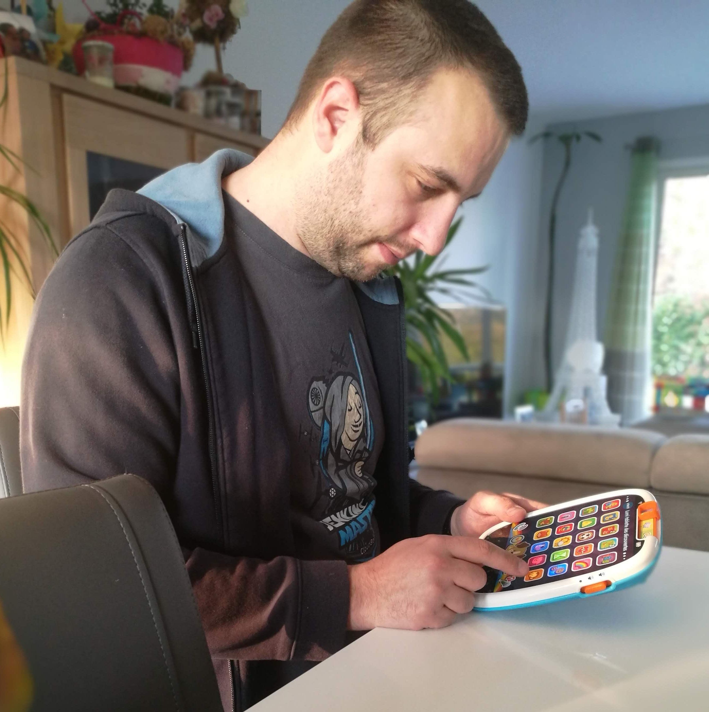

title: Need Hel(p)m ?
class: animation-fade
layout: true

<!-- This slide will serve as the base layout for all your slides -->

.bottom-bar[
\#DevoxxFR - @GhislainMahieux @PierreLeresteux
]

---

class: impact

# {{title}}

### REX : Helm en prod chez Saagie

.col-4[
Ghislain Mahieux
.radius[]
]
.col-4[
&nbsp;&nbsp;&nbsp;
]
.col-4[
Pierre Leresteux
.radius[]
]

---

# ATTENTION

.col-1[
&nbsp;&nbsp;&nbsp;
]
.col-10[
.center.big[
CETTE PRESNETATION N'EST PAS
UNE PRESNETATION SUR
KUBERNETEMSE
]

.right.italic[
MERCI DE VOTRE
COMPREHENSION
]
]

.col-1[
&nbsp;&nbsp;&nbsp;
]

---

# But de ce TIA

Déployer ma Super application "K" dans mon cluster Kubernetes.

- Via les commandes kubectl classiques
- Avec helm
- Need hel(p)m ?

---

# Helm

.responsive.full-width[]

---

class: impact

# Démo

---

class: impact

# Need Hel(p)m ?

---

# Oui si vous avez besoin de ...

.col-6[

- Templating (Helpers...)
- Rollback
- Packaging / Repository
- Conditionnal deployment
- Hooks
- Automatic reload
  ]
  .col-6[
  .radius.responsive.full-width[]
  .small.right["Bah celui qui fait ça c'est pas la moitié d'un trou d'balle!"]
  .quote.right[\- Perceval (Livre III, L'étudiant)]
  ]

---

# Mais attention à ...

.col-6[

- Gestion des PV
- Reprise sur erreurs
- Tiller
- Release timeout
- Gestion des secrets
- Hooks

]
.col-6[
.radius.responsive.full-width[]
.small.right["Ma parole, des engins comme vous, ça devrait être fourni avec une notice !"]
.quote.right[\- Léodagan (Livre I, La potion de Fécondité)]
]

---

# Au final...

.radius.width60[]
.small.right["Je gueule ; c'est vrai, j'suis un peu sec, tout ça, mais pour quelqu'un comme moi qui a facilement tendance à la dépression c'est très important ce que vous faites [...] pour la... la santé du... du cigare..."]
.quote.right[\- Arthur (Livre II, Unagi II)]

---

# Questions

.radius.width60[]
.small.right["Est-ce qu'on peut s'en servir pour donner de l'élan à un pigeon ?"]
.quote.right[\- Yvain (Livre III, L'étudiant)]
---

class: impact

# Merci

.col-2[&nbsp;]
.col-3[.responsive.full-width[]]
.col-2[&nbsp;]
.col-3[.responsive.full-width[]]
.col-2[&nbsp;]

.col-12.small.italic[
(Saagie Stand S20)]
